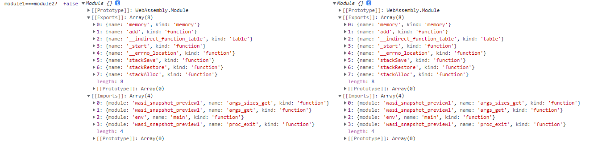

#  一文读懂WebAssembly——原理+实例

## 1 WebAssembly原理

### 1.1 什么是WebAssembly

WebAssembly主要用来提高程序在web浏览器上的执行效率，它是：

- **一种底层类汇编语言**，能够在所有当代浏览器以及大部分移动浏览器上高效运行。
- **一种编译目标**，因此可以将编译型语言（C++、Rust等）编写的代码编译成WebAssembly，在Web端运行。

### 1.2 WebAssembly工作原理

WebAssembly由开发者使用其他编程语言编写程序，并编译为WebAssembly二进制格式(.wasm文件)，然后由浏览器解析WebAssembly二进制代码为机器码执行。


以上列举了部分支持编译到WebAssembly的编程语言，各自使用不同的编译工具编译WebAssembly模块。也可以使用WebAssemly定义的**S-表达式**编译WebAssembly模块。WebAssembly模块可以被支持WebAssembly的浏览器解析并运行。

### 1.3 WebAssembly模块


#### 1. WebAssembly.Module

**`WebAssembly.Module`** 对象包含已经由浏览器编译的无状态 WebAssembly 代码,可以高效地与 Workers 共享、缓存在 IndexedDB 中，和多次实例化.`WebAssembly.Module()` 构造函数可以用来同步编译给定的 WebAssembly 二进制代码。不过，获取 `Module` 对象的主要方法是通过异步编译函数WebAssembly.compile()和WebAssembly.compileStreaming()：

- `WebAssembly.compile()` : 编译一个二进制wasm代码到一个`WebAssembly.Module`对象。
- `WebAssembly.compileStreaming()` : 从一个流式源中直接编译一个`WebAssembly.Module`对象。

一个二进制文件可以生成多个Module对象：

```js
        var module1, module2;
        var importObj1 = {
            env: {
                memory: new WebAssembly.Memory({initial: 1, maximum: 10}),
            }
        }
        fetch('add.wasm').then(response =>
            response.arrayBuffer()
        ).then(bytes => {
                WebAssembly.instantiate(bytes,importObj1).then(
                    res=>{
                        module1 = res.module;
                        console.log("module1 from instantiate:",module1);
                    }
                )
                return WebAssembly.compile(bytes)
            }
        ).then(module => {
            module2 = module;
            console.log("module2 from compile:", module2)
        });
```

获得的Module对象只是记录了二进制文件有哪些导入导出属性，并不记录那些属性本身，因此还无法直接使用，需要使用WebAssembly.instantiate()或WebAssembly.instantiateStreaming()获取WebAssembly.Instance对象才能通过Instance对象使用二进制代码中的方法和数据。

```js
                console.log("module1===module2? ", module1 === module2, module1, module2)
```



#### 2.WebAssembly.Instance

 **`WebAssembly.Instance`** 对象本身是有状态的，是 WebAssembly.Module 的一个可执行实例。 `Instance`包含所有的 WebAssembly 导出函数，允许从JavaScript 调用 WebAssembly 代码。一个WebAssembly.Module对象可以生成多个WebAssembly.Instance对象：

```js
 var instance1, instance2;
        var module1, module2;
        var importObj1 = {
            env: {
                memory: new WebAssembly.Memory({
                    initial: 1,
                    maximum: 10
                }),
                function: "_add",
                a:()=>{}
            }
        }
        var importObj2 = {
            env: {
                memory: new WebAssembly.Memory({
                    initial: 128,
                    maximum: 1024
                }),
            }
        }
        fetch('add.wasm').then(response =>
            response.arrayBuffer())
        .then(bytes => WebAssembly.compile(bytes))
        .then(module => {
            WebAssembly.instantiate(module, importObj1)
                .then(function (instance) {
                    instance1 = instance
                    console.log("instance1 :", instance1)
                });

            WebAssembly.instantiate(module, importObj1)
                .then(function (instance) {
                    instance2 = instance
                    console.log("instance2 :", instance2)
                });
        });

```


二者是不同的对象，各自有各自的导出属性以及线性内存区域，改变其中一个Instance的线性内存区域不会影响另一个Instance：

```js
console.log(
	"instance1 === instance2? ",
	instance1 === instance2, instance1,
	instance2);
let arr1 = new Uint8Array(instance1.exports.memory.buffer, 0, 800000)
arr1.fill(2)
```


#### 3.在不同Module产生的Instance之间共享线性内存

- **动态链接**

