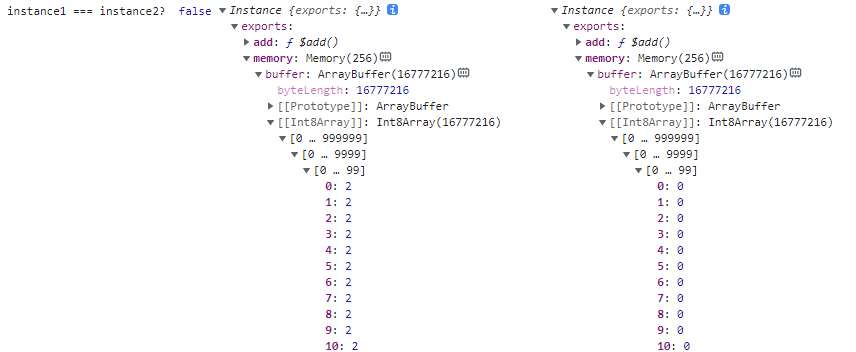

#  一文读懂WebAssembly——原理+实例

## 1 WebAssembly原理

### 1.1 什么是WebAssembly

WebAssembly（缩写为 Wasm）是一种安全、可移植、低级的代码格式，它有两种具体表示： **二进制格式**和**文本格式**。 它的主要目标是在 Web 上高性能的运行应用程序，并且不做任何特定于 Web 的假设或提供特定于 Web 的功能，因此它也可以在其他环境中使用。

- **一种底层类汇编语言**，能够在所有当代浏览器以及大部分移动浏览器上高效运行。
- **一种编译目标**，因此可以将编译型语言（C++、Rust等）编写的代码编译成WebAssembly，在Web端运行。

**wasm**是与操作系统和node版本无关的，一次编译，即可运行在linux、mac、windows等多个操作系统上，不需要为各个系统分别编译动态库， 在node8以上即支持了**wasm**，也无需担心node版本的兼容问题。

### 1.2 WebAssembly工作原理

开发者使用其他编程语言或WebAssembly文本格式编写程序，并编译为WebAssembly二进制格式(.wasm文件)，然后由浏览器解析WebAssembly二进制代码为机器码执行。


WebAssembly 不提供对执行代码的计算环境的环境访问，与环境的任何交互都只能通过调用嵌入器提供的函数并导入 WebAssembly 模块来执行 （例如 I/O、资源访问或操作系统调用）。 嵌入器可以通过控制或限制它使哪些功能可用于导入来建立适用于相应环境的安全策略。

WebAssembly 程序被组织成模块，模块是部署、加载和编译的单元。 模块收集类型、函数、表、内存和全局变量的定义。 此外，它可以声明导入和导出，并以数据和元素段或启动函数的形式提供初始化。

#### 1.2.1 生成[WebAssembly模块](https://webassembly.github.io/spec/core/syntax/modules.html#) 

生成WebAssembly模块，根据使用的编程语言可以使用不同的工具编译生成WebAssembly二进制文件(*.wasm)。也可以使用WebAssembly的**S-表达式**直接编写程序生成WebAssembly二进制文件。**S-表达式**也可以用来查看现有的WebAssembly二进制文件导出的函数和数据结构信息。目前对WebAssembly支持比较成熟的有编程语言有C/C++、 Rust和C#：

- **C/C++**     [Emscripten](https://github.com/emscripten-core/emscripten)是一个将C/C++代码编译为WebAssembly二进制文件的工具，也可以将稍大型的代码库转换为WebAssembly，目前已有不少成功从C++移植到WebAssembly的例子，如[字节跳动的一个跨端项目](http://cache.baiducontent.com/c?m=uv7SYDiMbkrAr0uRGkAIhY4AwYuIVF9yk1Nfjww7fRfsTR--Ey_AsWspK8YbFJ3EeHW6k7J69oRhpTA2XvKuoJpmj4HLc2GzGcloZoMfbcZICIOegyZeX2LzbTGJto-b&p=8a74c64ad4934eac59ebd66f445788&newp=c670ca16d9c108b919bd9b7d0c10c1231610db2151d6d6126b82c825d7331b001c3bbfb422201706d5c4786300ab4b5ee1f73272350923a3dda5c91d9fb4c57479c13175&s=eccbc87e4b5ce2fe&user=baidu&fm=sc&query=wasm%2Ddwarf&qid=a46aeff4000000de&p1=4)、[eBay扫码枪](https://tech.ebayinc.com/engineering/webassembly-at-ebay-a-real-world-use-case/)等。

- **Rust**       Rust正在致力于成为WebAssembly的首选语言，参见将rust项目部署到WebAssembly的[项目分享](https://zhuanlan.zhihu.com/p/38661879)

- **C#**           微软的项目模板blazor可以将C#编写的代码编译为WebAssembly, 参见[MSDN blazor教程](https://docs.microsoft.com/zh-cn/aspnet/core/blazor/tutorials?view=aspnetcore-6.0)

其他语言对WebAssembly的支持，参见github项目[Awesome WebAssembly Languages](https://github.com/appcypher/awesome-wasm-langs)，列出了支持WebAssembly的语言和各自编译WebAssembly的工具项目地址。

#### 1.2.2 在浏览器上运行WebAssembly

WebAssembly模块中导出到javascript环境的函数和数据结构等只能通过[WebAssembly命名空间](https://webassembly.github.io/spec/js-api/#webassembly-namespace)下的Instance类来使用：


Javascript提供了全局WebAssembly命名空间，提供了胶水代码编译二进制文件并使用其导出的函数和数据等。

- 通过fetch或者xmlhttpRequest的方法载入.wasm文件 
- 通过[WebAssembly.compile()](https://developer.mozilla.org/zh-CN/docs/Web/JavaScript/Reference/Global_Objects/WebAssembly/compile)编译二进制文件得到WebAssembly.Module对象，WebAssembly.Module记录了该二进制文件包含的导出信息和导入信息
- 通过WebAssembly.Instance可以同步构造以恶搞WebAssembly.instance对象， 但是通常推荐使用WebAssembly.instantiate()异步初始化得到WebAssembly.instance对象。只能通过WebAssembly.instance对象使用二进制文件中导出的函数和数据结构，

### 1.3 WebAssembly模块


#### 1. WebAssembly.Module

**`WebAssembly.Module`** 对象包含已经由浏览器编译的无状态 WebAssembly 代码,可以高效地与 Workers 共享、缓存在 IndexedDB 中，和多次实例化.`WebAssembly.Module()` 构造函数可以用来同步编译给定的 WebAssembly 二进制代码。不过，获取 `Module` 对象的主要方法是通过异步编译函数WebAssembly.compile()和WebAssembly.compileStreaming()：

- `WebAssembly.compile()` : 编译一个二进制wasm代码到一个`WebAssembly.Module`对象。
- `WebAssembly.compileStreaming()` : 从一个流式源中直接编译一个`WebAssembly.Module`对象并取得它的第一个Instance。

一个二进制文件可以生成多个Module对象：

```js
            fetch('add.wasm').then(response =>
                response.arrayBuffer()
            ).then(bytes => {

                WebAssembly.compile(bytes).then(module => {
                    module1 = module
                });
                
                WebAssembly.instantiate(bytes, importObj1).then(
                    res => {
                        module2 = res.module
                        console.log("module1===module2? ", module1 === module2)
                        console.log("module1:", module1, "module2:", module2)
                    }
                );
            });
```

WebAssembly.Module对象只是记录了二进制文件有哪些导入导出属性，并不记录那些属性本身，因此还无法直接使用，需要使用WebAssembly.instantiate()或WebAssembly.instantiateStreaming()获取WebAssembly.Instance对象才能通过Instance对象使用二进制代码中的方法和数据。


#### 2.WebAssembly.Instance

 **`WebAssembly.Instance`** 对象本身是有状态的，是 WebAssembly.Module 的一个可执行实例。 `Instance`包含所有的 WebAssembly 导出函数，允许从JavaScript 调用 WebAssembly 代码。一个WebAssembly.Module对象可以生成多个WebAssembly.Instance对象：

```js
 var instance1, instance2;
        var module1, module2;
        var importObj1 = {
            env: {
                memory: new WebAssembly.Memory({
                    initial: 1,
                    maximum: 10
                }),
                function: "_add",
                a:()=>{}
            }
        }
        var importObj2 = {
            env: {
                memory: new WebAssembly.Memory({
                    initial: 128,
                    maximum: 1024
                }),
            }
        }
        fetch('add.wasm').then(response =>
            response.arrayBuffer())
        .then(bytes => WebAssembly.compile(bytes))
        .then(module => {
            WebAssembly.instantiate(module, importObj1)
                .then(function (instance) {
                    instance1 = instance
                    console.log("instance1 :", instance1)
                });

            WebAssembly.instantiate(module, importObj1)
                .then(function (instance) {
                    instance2 = instance
                    console.log("instance2 :", instance2)
                });
        });

```


二者是不同的对象，各自有各自的导出属性以及线性内存区域，改变其中一个Instance的线性内存区域不会影响另一个Instance：

```js
console.log(
	"instance1 === instance2? ",
	instance1 === instance2, instance1,
	instance2);
let arr1 = new Uint8Array(instance1.exports.memory.buffer, 0, 800000)
arr1.fill(2)
```



#### 3.在不同Module产生的Instance之间共享线性内存

- **动态链接**

