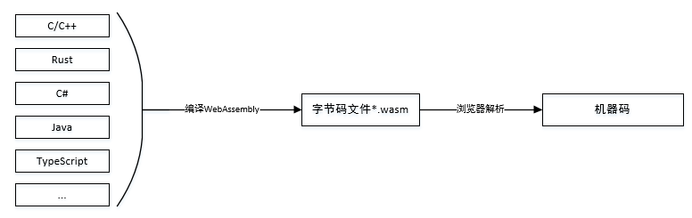
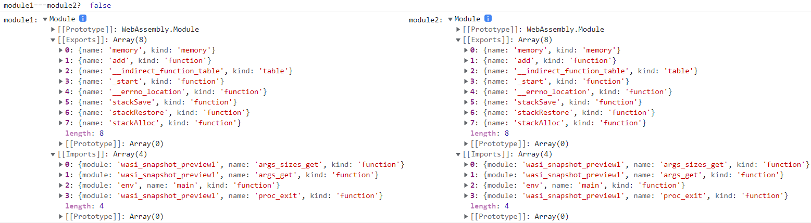

#  一文读懂WebAssembly——原理+实例

## 1 WebAssembly原理

### 1.1 什么是WebAssembly

WebAssembly（缩写为 Wasm）是一种安全、可移植、低级的代码格式，它有两种具体表示： **二进制格式**和**文本格式**。 它的主要目标是在 Web 上高性能的运行应用程序，并且不做任何特定于 Web 的假设或提供特定于 Web 的功能，因此它也可以在其他环境中使用。

- **一种底层类汇编语言**，能够在所有现代浏览器以及大部分移动浏览器上高效运行。
- **一种编译目标**，因此可以将编译型语言（C++、Rust等）编写的代码编译成WebAssembly，在Web端运行。

编译的**wasm**文件与操作系统和node版本无关，一次编译，即可运行在linux、mac、windows等多种操作系统上，不需要为各个系统分别编译动态库， 在node8以上即支持了**wasm**，也无需担心node版本的兼容问题。·

### 1.2 WebAssembly工作原理

开发者使用其他编程语言或WebAssembly文本格式编写程序，并编译为WebAssembly二进制格式(.wasm文件)，然后由浏览器解析WebAssembly二进制代码为机器码高效的执行。



WebAssembly 不提供对执行代码的计算环境的环境访问，与环境的任何交互都只能通过调用嵌入器提供的函数并导入 WebAssembly 模块来执行 （例如 I/O、资源访问或操作系统调用）。 嵌入器可以通过控制或限制它使哪些功能可用于导入来建立适用于对应环境的安全策略。

WebAssembly 程序被组织成模块，模块是部署、加载和编译的单元。它包含了类、函数、表、内存和全局变量的定义。 此外，模块还可以声明导入和导出，并以数据和元素段或启动函数的形式提供初始化。

编译模块后会产生WebAssembly.Module对象，该对象含有导入和导出两个插槽， 模块收集的类、函数、表、内存全局变量定义等将会包含在导出信息中，<span style='color:#f44'> 需要注意的是，编译模块的过程只会记录需要分配给此模块的内存信息而不会立即分配， 在浏览器上真正的为WebAssembly模块划分线性内存区域是在实例化模块产生Instance时完成的。</span>

实例化Module时将生成一个WebAssembly.Instance对象，并且逐一处理Module对象的导入导出属性，将他们逐一按照各自属性自身的格式保存到instance的imports属性里面；**导入属性**需要从外界的ImportObject接收，一旦一个模块声明了一个导入， [WebAssembly.instantiate()](https://developer.mozilla.org/zh-CN/docs/Web/JavaScript/Reference/Global_Objects/WebAssembly/instantiate)的调用者必须传递一个拥有相应属性的导入对象，否则会抛出linkError,比如表示需要从外界接受 wasi_snapshot_preview1对象的方法args_sizes_get， 但是目前的导入对象提供的args_sizes_get不是可调用对象（比如undefined)。对**导出属性**则会从module记录的各个导出属性的地址中逐一将其取出还原为真正的函数、表、全局对象或者内存，并将其保存到instance的exports属性里面。

关于WebAssembly模块编译和实例化产生WebAssembly.Module和WebAssembly.Instance的更多细节请参见[WebAssembly：modules](https://webassembly.github.io/spec/js-api/#modules)

#### 1.2.1 生成[WebAssembly模块](https://webassembly.github.io/spec/core/syntax/modules.html#) 

生成WebAssembly模块，根据使用的编程语言可以使用不同的工具编译生成WebAssembly二进制文件(*.wasm)。也可以使用WebAssembly的**S-表达式**直接编写程序生成WebAssembly二进制文件。**S-表达式**也可以用来查看现有的WebAssembly二进制文件导出的函数和数据结构信息。目前对WebAssembly支持比较成熟的有编程语言有C/C++、 Rust和C#：

- **C/C++**     [Emscripten](https://github.com/emscripten-core/emscripten)是一个将C/C++代码编译为WebAssembly二进制文件的工具，也可以将稍大型的代码库转换为WebAssembly，目前已有不少成功从C++移植到WebAssembly的例子，如[字节跳动一个跨端项目](http://cache.baiducontent.com/c?m=uv7SYDiMbkrAr0uRGkAIhY4AwYuIVF9yk1Nfjww7fRfsTR--Ey_AsWspK8YbFJ3EeHW6k7J69oRhpTA2XvKuoJpmj4HLc2GzGcloZoMfbcZICIOegyZeX2LzbTGJto-b&p=8a74c64ad4934eac59ebd66f445788&newp=c670ca16d9c108b919bd9b7d0c10c1231610db2151d6d6126b82c825d7331b001c3bbfb422201706d5c4786300ab4b5ee1f73272350923a3dda5c91d9fb4c57479c13175&s=eccbc87e4b5ce2fe&user=baidu&fm=sc&query=wasm%2Ddwarf&qid=a46aeff4000000de&p1=4)、[eBay扫码枪](https://tech.ebayinc.com/engineering/webassembly-at-ebay-a-real-world-use-case/)等。

- **Rust**       Rust正在致力于成为WebAssembly的首选语言，参见将rust项目部署到WebAssembly的[项目分享](https://zhuanlan.zhihu.com/p/38661879)

- **C#**          微软的项目模板blazor可以将C#编写的代码编译为WebAssembly, 参见[MSDN blazor教程](https://docs.microsoft.com/zh-cn/aspnet/core/blazor/tutorials?view=aspnetcore-6.0)

其他语言对WebAssembly的支持，参见github项目[Awesome WebAssembly Languages](https://github.com/appcypher/awesome-wasm-langs)，列出了支持WebAssembly的语言和各自编译WebAssembly的工具项目地址。

​	

#### 1.2.2 在浏览器上运行WebAssembly

WebAssembly模块中导出到javascript环境的函数和数据结构等只能通过[WebAssembly命名空间](https://webassembly.github.io/spec/js-api/#webassembly-namespace)下的Instance类来使用：


Javascript提供了全局WebAssembly命名空间，提供了胶水代码编译二进制文件并使用其导出的函数和数据等，其中WebAssembly.Instantiate函数提供了两种重载形式，分别可以从二进制文件编译模块并返回实例或者接受一个已编译的模块返回实例。

- 通过fetch或者xmlhttpRequest的方法载入.wasm文件 
- 通过[WebAssembly.compile()](https://developer.mozilla.org/zh-CN/docs/Web/JavaScript/Reference/Global_Objects/WebAssembly/compile)编译二进制文件得到WebAssembly.Module对象，然后导入对象和产生的Module对象作为instantiate函数的参数，获取到Instance.通过WebAssembly.Instance可以同步构造一个WebAssembly.instance对象， 但是通常推荐使用WebAssembly.instantiate()异步初始化得到WebAssembly.instance对象。另外，一些语言的WebAssembly编译工具在编译wasm文件时会自动生成js胶水代码辅助完成模块初始化，这时使用该js文件来完成初始化较为便利。


### 1.3 WebAssembly模块

#### 1. WebAssembly.Module

**`WebAssembly.Module`** 对象包含已经由浏览器编译的无状态 WebAssembly 代码,可以高效地与 Workers 共享、缓存在 IndexedDB 中，和多次实例化.`WebAssembly.Module()` 构造函数可以用来同步编译给定的 WebAssembly 二进制代码。不过，获取 `Module` 对象的主要方法是通过异步编译函数WebAssembly.compile()和WebAssembly.compileStreaming()：

- `WebAssembly.compile()` : 编译一个二进制wasm代码到一个`WebAssembly.Module`对象。
- `WebAssembly.compileStreaming()` : 从一个流式源中直接编译一个`WebAssembly.Module`对象并取得它的第一个Instance。

一个二进制文件可以生成多个Module对象：

```js
            fetch('add.wasm').then(response =>
                response.arrayBuffer()
            ).then(bytes => {
                WebAssembly.compile(bytes).then(module => {
                    module1 = module
                });                
                WebAssembly.instantiate(bytes, importObj1).then(
                    res => {
                        module2 = res.module
                        console.log("module1===module2? ", module1 === module2)
                        console.log("module1:", module1, "module2:", module2)
                    }
                );
            });
```

WebAssembly.Module对象只是记录了二进制文件有哪些导入导出属性，并不记录那些属性本身，因此还无法直接使用，需要使用WebAssembly.instantiate()或WebAssembly.instantiateStreaming()获取WebAssembly.Instance对象才能通过Instance对象使用二进制代码中的方法和数据。



#### 2.WebAssembly.Instance

 **`WebAssembly.Instance`** 对象本身是有状态的，是 WebAssembly.Module 的一个可执行实例。 `Instance`包含对应Module所有的 WebAssembly 导出函数，允许从JavaScript 调用 WebAssembly 代码。一个WebAssembly.Module对象可以生成多个WebAssembly.Instance对象：

```js
 var instance1, instance2;
        var module1, module2;
        var importObj1 = {
            env: { memory: new WebAssembly.Memory({ initial: 1,   maximum: 10 }),}
        }
        var importObj2 = {
            env: {memory: new WebAssembly.Memory({initial: 128, maximum: 1024 }),}
        }
        fetch('add.wasm').then(response =>
            response.arrayBuffer())
        .then(bytes => WebAssembly.compile(bytes))
        .then(module => {
            WebAssembly.instantiate(module, importObj1)
                .then(function (instance) {
                    instance1 = instance
                });
            WebAssembly.instantiate(module, importObj1)
                .then(function (instance) {
                    instance2 = instance
                });
        });

```

二者是不同的对象，各自有各自的导出属性以及线性内存区域，改变其中一个Instance的线性内存区域不会影响另一个Instance：

```js
console.log(
	"instance1 === instance2? ",
	instance1 === instance2, instance1,
	instance2);
let arr1 = new Uint8Array(instance1.exports.memory.buffer, 0, 800000)
arr1.fill(2)
```


## 2 WebAssembly实例

### 2.1 在web进行dicom序列数据校验

#### 2.1.1 背景

已有C++的dicom序列数据校验程序库DicomDataChecker，它接受一个序列所有dicom文件的tag信息，对此序列进行数据校验，校验规则包括所有图层的世界坐标系原点和方向一致、图像数据维度一致、序列号连续等等。这些不同的校验规则在程序库内继承自同一个数据校验基类，向外暴露出一个接口类DicomDataChecker，提供初始化数据校验规则，遍历所有校验规则进行校验，返回校验信息的功能。每一张dicom图像的tag被组织成字符串字典的列表，因此整个序列待校验数据的数据结构为两重列表，列表的元素是字符串字典， 即 vector<vector<map<string,string>>>。

#### 2.1.2 导出函数与数据结构

在web Assembly支持的数据类型只有int32,int64,float32,float64四种，字符串需要在javascript环境下使用Webassembly提供的_malloc函数申请内存，然后用stringToUTF8向申请到的内存区域写入字符串内容，将内存首地址按int型传递到c++环境，在C++中用reinterpret_cast<char *>构造string对象。像这样：

```js
                ///js code
			   var jsString = 'this is a string';
                var lengthBytes = Module.lengthBytesUTF8(jsString) + 1;
                var stringOnWasmHeap = Module._malloc(lengthBytes);
                Module.stringToUTF8(jsString, stringOnWasmHeap, lengthBytes);
                Module.getString(stringOnWasmHeap)  //C++导出的函数
                Module._free(stringOnWasmHeap)

			  // c++ code
                std::string getString(int addr)
                {
                    return std::string(reinterpret_cast<char *>(addr));
                }
```

如此一来，在构建C++校验数据时，需要遍历序列内所有键值对，逐一将其转换为std::string并且组织成为vector<vector<map<string,string>>>，校验完毕之后还要再次遍历此数据将它的空间释放掉，非常复杂，因此选择使用Emscripten的[embind](https://emscripten.org/docs/porting/connecting_cpp_and_javascript/embind.html)，将数据结构导出到webassembly中，embind导出的数据结构都有delete成员用于释放内存空间，在javascript环境管理数据非常方便。

使用embind时，需要编译的C++程序库中添加头文件

```c++
#include <emscripten/emscripten.h>
#include <emscripten/bind.h>
```

然后再cpp中声明需要注册的模块，本例中我们向外部导出一个DicomSeriesDataChecker类，我们使用getCheckerInstance方法作为它在js环境的构造方法，并导出校验函数call， 另外想js环境注册两个数据结构：map<string,string> 注册为MapString， vector<map<string,string>>注册为VectorTag:

```c++
EMSCRIPTEN_BINDINGS(stl_wrappers)
{
	class_<DicomSeriesDataChecker>("DicomSeriesDataChecker")  //注册数据校验接口类
		.constructor(&getCheckerInstance, allow_raw_pointers())  
		.function("call", &DicomSeriesDataChecker::call);

	register_vector<std::map<std::string, std::string>>("VectorTag");
	register_map<std::string, std::string>("MapString");
}
```

#### 2.1.3编译

编译webAssembly时指定bind模式和C++标准，指定C++标准，需要在指定编译参数--std=标准（目前已经支持到C++20）:

```bash
emcc ./DcmDataChecker.cpp -o DcmDatachecker.js --bind --std=C++11 -O3
```

#### 2.1.4 校验

然后利用emscripten生成的初始化代码来初始化webassembly模块，通过该模块的导出属性进行数据校验了：

```js
            // <script src="./DcmDatachecker.js"></script>  //需要导入编译生成的js文件
		   let checker =new Module.DicomSeriesDataChecker(0);
            data = new Module.VectorTag();
            JsonData.forEach(element => {   //JsonData是一个序列的tag数据json格式，是一个列表，里面每一个对象表示一张dicom的tag，以键值对储存。
                var a = new Module.MapString()
                Object.entries(element).forEach((item) => {
                    a.set(item[0], item[1])
                })
                data.push_back(a);
            });
            var res = checker.call(data)
            data.delete()    //释放空间
            checker.delete()  //释放空间
            alert("校验结果:" + res);
```


我们知道一个dicom序列，从机器扫描下来后，它的instance number是连续的，当我们把Json文件中的某一张dicom的instance number改为其他值，模拟instance number不连续的序列，则校验结果为：


